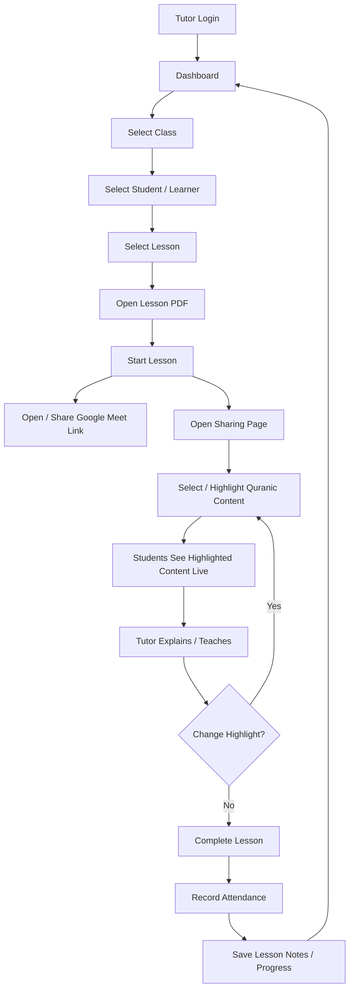
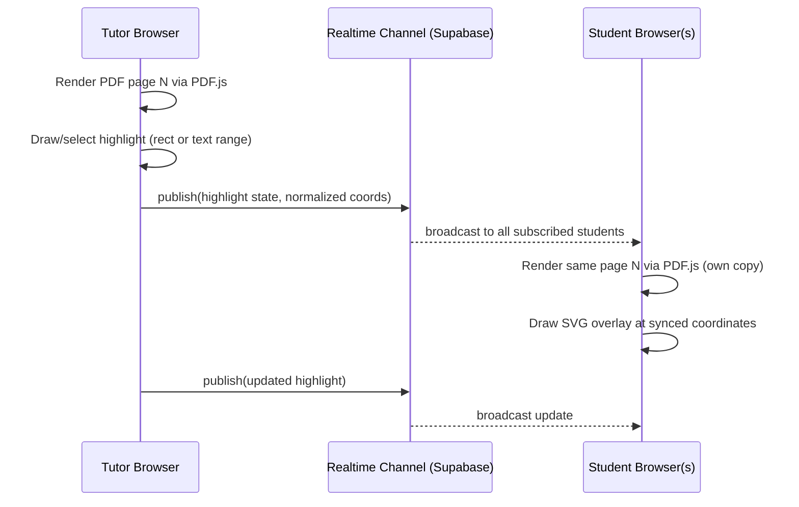
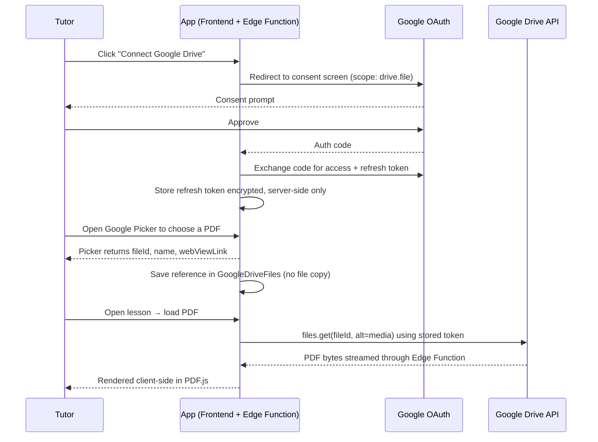
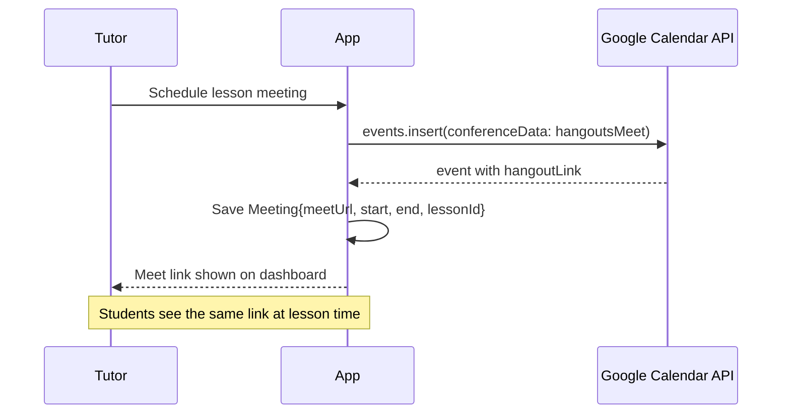
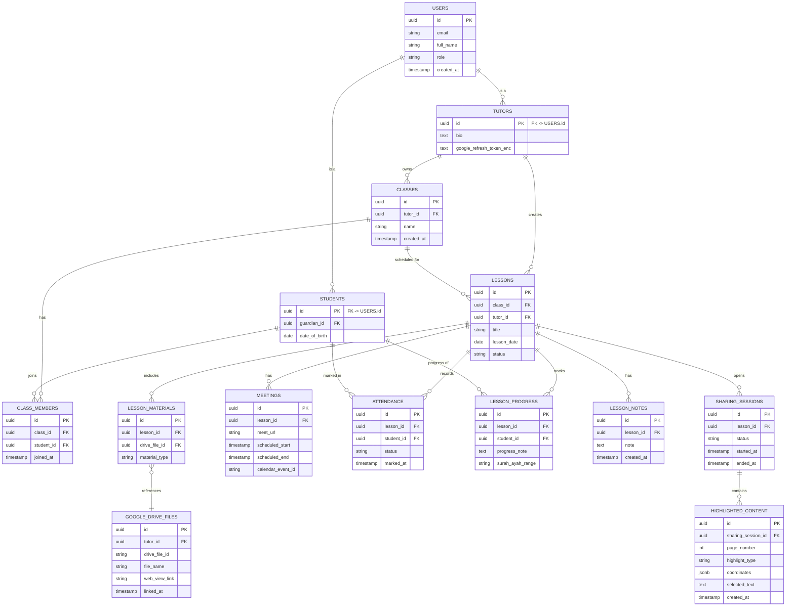

# Quranic Teacher — Online Quran Learning Management Solution
## Architecture, Research & Implementation Plan

> **Freshness note:** Free-tier limits and OAuth policies for Google, Supabase, Vercel, Netlify, Cloudflare, and Firebase change fairly often. The figures in this document reflect my knowledge as of early 2026. Before you commit to a platform, re-check its current pricing/limits page — I've flagged the numbers most likely to drift, and the ToS clauses (e.g. Vercel's Hobby-plan restriction) that matter most for a paid tutoring service.

---

## 1. Solution Overview

A lightweight web application that lets an independent Quran tutor manage students, classes, and lessons; store or reference lesson PDFs (locally or via Google Drive); run lessons over Google Meet; and — the core differentiator — let the tutor highlight a specific Ayah, word, line, or region of a PDF and have that highlight appear on every student's screen in near real time, without screen-sharing or video streaming the PDF itself.

The design goal throughout is: **run at $0/month for a solo tutor with a handful of classes**, stay simple enough for a non-technical tutor to operate, and avoid locking into a single vendor for anything that matters (auth, database, files).

---

## 2. Functional Requirements

| Module | Requirements |
|---|---|
| Auth | Tutor & student login, role-based redirect, session persistence |
| Class/Student Mgmt | CRUD students, CRUD classes, assign students to classes |
| Lesson Mgmt | CRUD lessons, link a lesson to a class, attach one or more PDFs |
| PDF Source | Upload PDF directly, **or** reference a Google Drive file |
| PDF Viewer | Paginate, zoom, view Arabic text correctly (RTL where relevant) |
| Highlighting | Rectangle, text-range (word/line/paragraph), or free-form selection; changeable live |
| Sharing Page | Tutor's current page + highlight broadcasts to all students in the session |
| Meet Integration | Store/generate a Meet link per lesson; one-click join for students |
| Attendance | Manual mark by tutor (MVP); automatic via Meet API (Phase 2, Workspace-only) |
| History | Past lessons, notes, progress per student |
| Dashboard | Today's/upcoming lessons, active lesson, quick links |

## 3. Non-Functional Requirements

- **Latency:** highlight sync should feel "live" — target under ~500ms end-to-end, not video-frame-rate.
- **Availability:** acceptable to have a few seconds of cold-start delay on a free tier; not acceptable to lose lesson data.
- **Cost:** $0/month at MVP scale (1 tutor, ~30 students, a few lessons/day); a clear, cheap upgrade path if it grows.
- **Usability:** the tutor should reach "start teaching" in 2–3 clicks from the dashboard.
- **Security/Privacy:** several students will be minors — see §16.
- **Localization:** Arabic script must render correctly in the PDF viewer and UI must support RTL text blocks even if the app chrome itself stays LTR.
- **Portability:** avoid features that only exist on one vendor's proprietary API where a standard alternative exists (prefer Postgres over a proprietary NoSQL format, prefer standard OAuth over vendor-specific SDKs where reasonable).
- **Device support:** desktop (primary, for tutor), tablet and mobile (secondary, mainly for students).

---

## 4. User Roles & Permissions

| Capability | Tutor | Student | Parent/Guardian (future) |
|---|:---:|:---:|:---:|
| Login | ✅ | ✅ | ✅ |
| Manage students/classes | ✅ | ❌ | View only, own children |
| Manage lessons & materials | ✅ | ❌ | ❌ |
| Connect Google Drive | ✅ | ❌ | ❌ |
| Schedule/manage Meet links | ✅ | ❌ | ❌ |
| Start a lesson / control Sharing Page | ✅ | ❌ | ❌ |
| Join Meet | ✅ | ✅ | View link only |
| View live highlighted content | ✅ (controls it) | ✅ (read-only) | ❌ |
| View own lesson history / progress | ✅ (all students) | ✅ (self only) | ✅ (own children) |
| View attendance | ✅ (all) | ✅ (self) | ✅ (own children) |

A **Parent/Guardian** role is worth adding early rather than late, precisely *because* students may be minors — it gives a natural, low-friction way to keep a responsible adult in the loop (booking, progress, attendance) without the student needing an independent account. I'd treat it as a fast-follow rather than deferring it deep into Phase 2.

---

## 5. End-to-End Process Flow



---

## 6. System Architecture Diagram

```mermaid
flowchart LR
    subgraph Client["Client Layer (Browser)"]
        TutorApp[Tutor Web App]
        StudentApp[Student Web App]
    end

    subgraph Hosting["Static/Edge Hosting"]
        Pages[Cloudflare Pages / Netlify\n(Frontend build)]
    end

    subgraph Supabase["Supabase (Backend-as-a-Service)"]
        Auth[Auth\n(email + Google OAuth)]
        DB[(Postgres DB)]
        RT[Realtime Channels]
        EdgeFn[Edge Functions\n(OAuth exchange, Drive proxy)]
        Storage[Storage\n(uploaded PDFs, optional)]
    end

    subgraph GoogleCloud["Google Cloud"]
        GOAuth[Google OAuth 2.0]
        Drive[Drive API]
        Cal[Calendar API\n(Meet link generation)]
        Meet[Google Meet]
    end

    TutorApp --> Pages
    StudentApp --> Pages
    Pages --> Auth
    Pages --> DB
    Pages --> RT
    Pages --> EdgeFn
    EdgeFn --> GOAuth
    GOAuth --> Drive
    GOAuth --> Cal
    Cal --> Meet
    TutorApp -. highlight/page sync .-> RT
    StudentApp -. highlight/page sync .-> RT
```

---

## 7. PDF Sharing Architecture (core feature)

### 7.1 Technical approaches compared

| Approach | How it works | Fidelity | Latency/Bandwidth | Complexity | Verdict |
|---|---|---|---|---|---|
| **PDF.js + SVG/Canvas overlay** | Every client renders the *same* PDF locally; only page #, zoom, and highlight coordinates are synced as small JSON | Perfect (native PDF rendering) | Tiny payload (a few hundred bytes per update) | Medium | **Recommended** |
| Canvas-based highlighting only | Same as above but draw directly on the PDF.js canvas instead of a separate SVG layer | Good | Same as above | Medium | Viable, slightly harder to make highlights resizable/interactive |
| Screenshot / cropped-region streaming | Tutor's app renders a highlighted crop as an image and pushes that image to students | Good, but re-renders full images repeatedly | High bandwidth, laggier | Low | Only worth it as a fallback for exotic PDFs (scanned images with no text layer) |
| WebRTC screen share | Full screen-share of tutor's PDF viewer | Perfect but heavyweight | High (video stream) | High | Overkill — this problem doesn't need video, it needs state sync |

**Recommendation:** render the PDF independently in every browser with PDF.js (open-source, MIT-licensed, mature, handles Arabic text layers correctly) and synchronize only a small *state object* over a realtime channel. This is dramatically cheaper on bandwidth than any screenshot/streaming approach and gives pixel-perfect, zoomable rendering on the student side.

### 7.2 What gets synchronized

```json
{
  "lessonId": "uuid",
  "materialId": "uuid",
  "pageNumber": 12,
  "zoomLevel": 1.25,
  "scrollPosition": { "x": 0, "y": 240 },
  "highlightType": "rect | text | ayah",
  "coordinates": { "x": 0.12, "y": 0.34, "width": 0.6, "height": 0.08 },
  "selectedText": "optional, if using PDF.js text layer selection",
  "sessionStatus": "active",
  "updatedAt": "ISO timestamp"
}
```

Coordinates are stored as **fractions of page width/height (0–1)**, not pixels — this keeps the highlight correct regardless of each student's screen size or zoom level.

### 7.3 Sync sequence



### 7.4 Technology choice for the realtime layer

Supabase Realtime (built on Phoenix Channels, WebSocket-based) is the natural fit here because it's bundled with the same backend that's handling auth/DB — no separate service to pay for or manage. Plain **Socket.io/WebSocket** on a Node server would work equally well technically, but adds a service you'd need to host and keep warm; **Firebase Realtime Database/Firestore** is also viable if you go the Firebase route in §11. **WebRTC/SignalR are not necessary** for this feature — they solve peer-to-peer media/streaming problems, not small-state broadcast.

---

## 8. Google Drive Integration Flow



**Key decisions:**

- **Scope:** request `drive.file` (per-file, app-created-or-picked access) rather than `drive.readonly` or full `drive`. It's the least-privileged scope that still lets the tutor pick any file via the Google Picker, and it keeps you out of Google's stricter "restricted scope" verification tier for as long as possible.
- **No duplication:** store only `{ driveFileId, name, webViewLink }` in your DB. Stream the PDF bytes through a server-side function when needed rather than copying the file into your own storage — this respects "maintain a reference, not a copy" and also means Drive-side permission changes (e.g. tutor revokes access) take effect immediately.
- **No paid Workspace required:** Drive API and the Picker both work fine with a personal Google account (@gmail.com) or a free Google Cloud project — no Workspace subscription needed.
- **OAuth verification:** while your app is in "Testing" mode in Google Cloud Console, up to 100 test users can authorize without any Google review. Beyond that (or once you "publish" the app), Google requires an app verification/branding review for scopes it classifies as sensitive — `drive.file` has a lighter review path than `drive.readonly`/`drive`. Budget a few days to a few weeks for this once you outgrow 100 users; it is **free**, but it is not instant.
- **Token refresh caveat:** Google only returns a `refresh_token` on the *first* consent. If you're using Supabase Auth's "Google" provider for login as well as Drive access, note that Supabase's session refresh does **not** automatically refresh the Google *provider* token — you need to store and refresh that separately server-side (in the Edge Function), or use a distinct "Connect Drive" OAuth flow independent of login.

**Simpler fallback (recommended for the very first MVP cut):** skip Drive API integration entirely for v0. Let the tutor upload PDFs directly into Supabase Storage (1GB free). This removes an entire OAuth/verification surface from the MVP and can be added in Phase 2 once the core teaching workflow is validated.

---

## 9. Google Meet Integration Flow

| | **Option A — Manual URL** | **Option B — Calendar API** |
|---|---|---|
| How | Tutor creates a Meet manually (meet.google.com or their calendar app) and pastes the link into a lesson | App calls Google Calendar API to create an event with `conferenceData` set to auto-generate a Meet link |
| Setup effort | None — just a text field | OAuth (calendar scope), API call, error handling |
| Works with personal Gmail | ✅ | ✅ (Calendar API + auto-Meet works for personal accounts, no Workspace needed) |
| Automatic reminders on tutor's calendar | ❌ | ✅ |
| Automatic attendance tracking | ❌ | ❌ for personal accounts — Meet's attendance/activity reporting API is a **Google Workspace (paid, Business Standard+)** feature only |
| Recommended for | **MVP** | **Phase 2** |



Because true attendance tracking via the Meet API requires a paid Workspace plan, **manual attendance marking by the tutor** is the right MVP choice regardless of which Meet option you pick — it's free, simple, and good enough for a small tutoring practice.

---

## 10. Free Deployment Platforms — Comparison

| Platform | Frontend | Backend/API | Database | Auth | File Storage | Google APIs | Free Tier (approx., verify current) | Notable Limitations | Recommended? |
|---|---|---|---|---|---|---|---|---|---|
| **Cloudflare Pages/Workers** | ✅ Static/SSR | ✅ Workers (100k req/day free) | Via D1 (SQLite-based, free tier) or external | Roll your own / external | R2 (10GB free, no egress fees) | Call from Workers | Generous bandwidth, no non-commercial clause | Durable Objects (useful for realtime) need the **paid** Workers plan (~$5/mo) | ✅ For frontend + edge functions |
| **Vercel** | ✅ Next.js-native | ✅ Serverless functions | External only | External | External | Call from API routes | 100GB bandwidth, generous build minutes | **Hobby plan ToS restricts to personal/non-commercial use** — a paid tutoring service should budget for Pro ($20/mo) | ⚠️ Great DX, watch the ToS |
| **Netlify** | ✅ Static/SSR | ✅ Functions (10s timeout on free) | External only | External | External | Call from Functions | 100GB bandwidth/mo | No websockets natively; no explicit non-commercial clause | ✅ Solid alternative to Vercel |
| **GitHub Pages** | ✅ Static only | ❌ | ❌ | ❌ | ❌ | ❌ | Free, unlimited for public repos | No backend at all — needs to be paired with something | ⚠️ Frontend-only piece |
| **Supabase** | ❌ | ✅ Edge Functions (Deno) | ✅ Postgres (500MB free) | ✅ Built-in (50k MAU free) | ✅ 1GB free | Call from Edge Functions | Realtime included | Free projects **pause after ~1 week of inactivity** (auto-resumes on next request, with a short delay) | ✅ Core backend recommendation |
| **Firebase** | ✅ Hosting | ⚠️ Functions need **Blaze** (pay-as-you-go) for outbound network calls | Firestore (NoSQL, 1GiB free) | ✅ Built-in | ✅ 5GB free | Requires Blaze for calling Drive/Calendar APIs from Functions | Generous free reads/writes | Blaze is "pay-as-you-go," not truly free once you call external APIs — usually pennies at small scale, but not $0 | ⚠️ Good alternative if you prefer Google-native ecosystem |

**Bottom line:** no single "free hosting" platform gives you everything. The realistic zero-cost combination is a **static/edge frontend host** (Cloudflare Pages or Netlify) + **Supabase** as the one BaaS that bundles Postgres, Auth, Realtime, Storage, and serverless functions in a single free tier — which is also why it anchors the recommended architecture below.

---

## 11. Recommended Architecture Options

### Option 1 — Maximum Free / Serverless *(Recommended for MVP)*
**Components:** Cloudflare Pages (or Netlify) for the frontend · Supabase (Postgres + Auth + Realtime + Storage + Edge Functions) for everything else · Google Drive/Calendar APIs called from Supabase Edge Functions.

- **Cost:** $0/month at MVP scale.
- **Complexity:** Medium — one BaaS to learn, but it covers auth/db/realtime/functions/storage so there's little glue code.
- **Scalability:** Fine up to a few hundred students; DB/storage caps become the first thing to watch.
- **Security:** Postgres Row Level Security gives solid, auditable per-role access control.
- **Google integration complexity:** Medium (OAuth + Picker + Edge Function proxy).
- **Advantages:** Single source of truth for backend state; realtime built-in for the highlight-sync feature; no card-charge-required signup on Supabase's free tier.
- **Disadvantages:** Supabase free projects pause on inactivity (minor UX hiccup, not data loss); Cloudflare's fanciest realtime primitive (Durable Objects) isn't needed here since Supabase Realtime covers it.

### Option 2 — Simple Full-Stack
**Components:** Next.js (frontend + API routes) on Vercel or Netlify · Supabase Postgres for data · Google Drive/Calendar APIs called from Next.js API routes.

- **Cost:** $0/month on Netlify; on Vercel, technically $0 but only compliant with ToS if the service stays non-commercial.
- **Complexity:** Low-Medium — most familiar to React/Next developers.
- **Scalability:** Similar ceiling to Option 1.
- **Advantages:** Excellent developer experience, huge community/tooling support, easy to hire for later.
- **Disadvantages:** Two vendors instead of one for "backend logic" (hosting functions + Supabase for data); Vercel's commercial-use clause is a real constraint for a paid tutoring business.

### Option 3 — Minimal / Firebase-centric
**Components:** Firebase Hosting + Firestore + Firebase Auth + Cloud Functions (Blaze plan) · Google Drive/Calendar APIs called from Cloud Functions · manual Google Meet links.

- **Cost:** Near-zero, but technically requires a billing-enabled (Blaze) project because Functions need outbound network access to call Google APIs — in practice this bills pennies at MVP scale, not $0.00 flat.
- **Complexity:** Low if you're already comfortable with Firebase/Firestore's NoSQL model.
- **Advantages:** Same vendor (Google) for auth, hosting, and the Drive/Meet APIs you're integrating with — one console, one billing relationship.
- **Disadvantages:** Firestore's document model is a slightly worse fit for the relational data here (classes ↔ students ↔ lessons ↔ attendance) than Postgres; requires enabling billing even if the bill stays at $0.00–$1.00.

### Recommendation for MVP

**Option 1** — Cloudflare Pages (or Netlify) + Supabase. It's the only combination that is (a) genuinely commercial-use-friendly on every layer, (b) $0 with no billing card required anywhere, (c) relational (fits this domain naturally), and (d) has realtime sync built in for the one feature that actually needs it.

---

## 12. Database ER Diagram



## 13. Database Schema (PostgreSQL DDL)

```sql
-- Core identity
CREATE TABLE users (
  id UUID PRIMARY KEY DEFAULT gen_random_uuid(),
  email TEXT UNIQUE NOT NULL,
  full_name TEXT NOT NULL,
  role TEXT NOT NULL CHECK (role IN ('tutor','student','guardian')),
  created_at TIMESTAMPTZ DEFAULT now()
);

CREATE TABLE tutors (
  id UUID PRIMARY KEY REFERENCES users(id) ON DELETE CASCADE,
  bio TEXT,
  google_refresh_token_enc TEXT  -- encrypted at rest, server-side only
);

CREATE TABLE students (
  id UUID PRIMARY KEY REFERENCES users(id) ON DELETE CASCADE,
  guardian_id UUID REFERENCES users(id),
  date_of_birth DATE
);

-- Classes & membership
CREATE TABLE classes (
  id UUID PRIMARY KEY DEFAULT gen_random_uuid(),
  tutor_id UUID NOT NULL REFERENCES tutors(id) ON DELETE CASCADE,
  name TEXT NOT NULL,
  created_at TIMESTAMPTZ DEFAULT now()
);
CREATE INDEX idx_classes_tutor ON classes(tutor_id);

CREATE TABLE class_members (
  id UUID PRIMARY KEY DEFAULT gen_random_uuid(),
  class_id UUID NOT NULL REFERENCES classes(id) ON DELETE CASCADE,
  student_id UUID NOT NULL REFERENCES students(id) ON DELETE CASCADE,
  joined_at TIMESTAMPTZ DEFAULT now(),
  UNIQUE (class_id, student_id)
);
CREATE INDEX idx_class_members_class ON class_members(class_id);
CREATE INDEX idx_class_members_student ON class_members(student_id);

-- Lessons & materials
CREATE TABLE lessons (
  id UUID PRIMARY KEY DEFAULT gen_random_uuid(),
  class_id UUID NOT NULL REFERENCES classes(id) ON DELETE CASCADE,
  tutor_id UUID NOT NULL REFERENCES tutors(id),
  title TEXT NOT NULL,
  lesson_date DATE NOT NULL,
  status TEXT NOT NULL DEFAULT 'scheduled' CHECK (status IN ('scheduled','active','completed','cancelled'))
);
CREATE INDEX idx_lessons_class_date ON lessons(class_id, lesson_date);

CREATE TABLE google_drive_files (
  id UUID PRIMARY KEY DEFAULT gen_random_uuid(),
  tutor_id UUID NOT NULL REFERENCES tutors(id) ON DELETE CASCADE,
  drive_file_id TEXT NOT NULL,
  file_name TEXT NOT NULL,
  web_view_link TEXT,
  linked_at TIMESTAMPTZ DEFAULT now(),
  UNIQUE (tutor_id, drive_file_id)
);

CREATE TABLE lesson_materials (
  id UUID PRIMARY KEY DEFAULT gen_random_uuid(),
  lesson_id UUID NOT NULL REFERENCES lessons(id) ON DELETE CASCADE,
  drive_file_id UUID REFERENCES google_drive_files(id),
  storage_path TEXT,        -- alternative: file uploaded directly to Supabase Storage
  material_type TEXT DEFAULT 'pdf'
);
CREATE INDEX idx_lesson_materials_lesson ON lesson_materials(lesson_id);

-- Meetings & attendance
CREATE TABLE meetings (
  id UUID PRIMARY KEY DEFAULT gen_random_uuid(),
  lesson_id UUID NOT NULL REFERENCES lessons(id) ON DELETE CASCADE,
  meet_url TEXT NOT NULL,
  scheduled_start TIMESTAMPTZ,
  scheduled_end TIMESTAMPTZ,
  calendar_event_id TEXT
);
CREATE INDEX idx_meetings_lesson ON meetings(lesson_id);

CREATE TABLE attendance (
  id UUID PRIMARY KEY DEFAULT gen_random_uuid(),
  lesson_id UUID NOT NULL REFERENCES lessons(id) ON DELETE CASCADE,
  student_id UUID NOT NULL REFERENCES students(id) ON DELETE CASCADE,
  status TEXT NOT NULL CHECK (status IN ('present','absent','late','excused')),
  marked_at TIMESTAMPTZ DEFAULT now(),
  UNIQUE (lesson_id, student_id)
);
CREATE INDEX idx_attendance_student ON attendance(student_id);

-- Progress, notes
CREATE TABLE lesson_progress (
  id UUID PRIMARY KEY DEFAULT gen_random_uuid(),
  lesson_id UUID NOT NULL REFERENCES lessons(id) ON DELETE CASCADE,
  student_id UUID NOT NULL REFERENCES students(id) ON DELETE CASCADE,
  progress_note TEXT,
  surah_ayah_range TEXT
);
CREATE INDEX idx_progress_student ON lesson_progress(student_id);

CREATE TABLE lesson_notes (
  id UUID PRIMARY KEY DEFAULT gen_random_uuid(),
  lesson_id UUID NOT NULL REFERENCES lessons(id) ON DELETE CASCADE,
  note TEXT NOT NULL,
  created_at TIMESTAMPTZ DEFAULT now()
);

-- Live sharing
CREATE TABLE sharing_sessions (
  id UUID PRIMARY KEY DEFAULT gen_random_uuid(),
  lesson_id UUID NOT NULL REFERENCES lessons(id) ON DELETE CASCADE,
  status TEXT NOT NULL DEFAULT 'active' CHECK (status IN ('active','ended')),
  started_at TIMESTAMPTZ DEFAULT now(),
  ended_at TIMESTAMPTZ
);

CREATE TABLE highlighted_content (
  id UUID PRIMARY KEY DEFAULT gen_random_uuid(),
  sharing_session_id UUID NOT NULL REFERENCES sharing_sessions(id) ON DELETE CASCADE,
  page_number INT NOT NULL,
  highlight_type TEXT NOT NULL CHECK (highlight_type IN ('rect','text','ayah')),
  coordinates JSONB NOT NULL,   -- {x,y,width,height} normalized 0-1
  selected_text TEXT,
  created_at TIMESTAMPTZ DEFAULT now()
);
CREATE INDEX idx_highlight_session ON highlighted_content(sharing_session_id);
```

Row Level Security (RLS) policies (Supabase/Postgres) should be layered on top of every table so students can only read rows tied to classes they belong to, and tutors can only read/write their own classes/lessons — see §16.

---

## 14. Recommended Technology Stack

| Layer | Choice | Why |
|---|---|---|
| Frontend framework | **React (Next.js or Vite SPA)** | Best PDF.js community support, huge hiring pool, works cleanly with Supabase JS client |
| Styling | Tailwind CSS | Fast to build a clean, responsive teaching UI |
| PDF rendering | **PDF.js** | Open-source (MIT), mature, correct Arabic/RTL text-layer support, works entirely client-side |
| Backend/BaaS | **Supabase** | Postgres + Auth + Realtime + Storage + Edge Functions in one free tier; relational model fits this domain |
| Realtime sync | **Supabase Realtime (WebSocket/Phoenix channels)** | Already bundled; no extra service to run for the highlight-sync feature |
| Hosting | **Cloudflare Pages** (or Netlify) | Commercial-use friendly, generous free bandwidth, simple CI from Git |
| Auth | **Supabase Auth** (email/password + Google OAuth) | Free, built-in, Google OAuth doubles as the on-ramp for Drive/Calendar consent |
| Google integration | `googleapis` Node SDK inside Supabase Edge Functions | Keeps client secrets and refresh tokens off the browser entirely |

**Why not Blazor/.NET here:** nothing about this app needs a heavyweight server framework, and PDF.js + a JS ecosystem gives the most mature, battle-tested path for both PDF rendering and Google API client libraries. If your team is already a .NET shop, an ASP.NET Core + SignalR backend is a perfectly reasonable substitute for the Supabase layer — SignalR would replace Supabase Realtime one-for-one — but it removes the "one free BaaS covers everything" advantage that keeps this at $0/month.

---

## 15. Free-Tier Cost Analysis (at MVP scale: 1 tutor, ~30 students, a few lessons/day)

| Resource | Expected usage | Free allowance | Monthly cost |
|---|---|---|---|
| Cloudflare Pages hosting | Static/SPA assets | Effectively unlimited requests | $0 |
| Supabase Postgres | A few MB of rows (classes/lessons/attendance) | 500MB | $0 |
| Supabase Storage (if not using Drive) | A modest library of lesson PDFs | 1GB | $0 |
| Supabase Auth | ~30–50 users | 50,000 MAU | $0 |
| Supabase Realtime | Short, bursty sessions during lessons | Well within free concurrent-connection limits | $0 |
| Supabase Edge Functions | OAuth exchange + Drive proxy calls | Free tier invocation allowance | $0 |
| Google Drive/Calendar API | Personal-scale quota | Effectively free (huge daily quota) | $0 |

**What would push you into a paid tier:** a large library of PDFs (Storage), a big jump in concurrent students (Realtime connection caps), or wanting the paid Workspace-only Meet attendance API. None of these are likely at "one tutor's practice" scale.

---

## 16. Security & Privacy Model

- **Row Level Security (RLS)** on every Supabase table — students can only `SELECT` rows for classes they're members of; tutors are scoped to their own classes/lessons.
- **OAuth tokens never touch the browser.** Google access/refresh tokens are exchanged and stored server-side (Edge Function + encrypted column), never exposed to client JS.
- **HTTPS everywhere** — default on Cloudflare Pages/Netlify/Supabase, no extra work needed.
- **Least-privilege scopes** — `drive.file` over `drive`/`drive.readonly` (see §8).
- **Minors' data:** collect the minimum necessary (name, class membership, progress notes) — avoid storing anything beyond what's needed to run lessons. Consider routing student account creation/management through the guardian for younger students rather than the student directly.
- **Regulatory awareness:** if students are minors, be aware of children's-privacy regimes relevant to your users' jurisdictions (e.g. COPPA in the US, GDPR-K provisions in the EU/UK). This is a legal question worth a real lawyer's five minutes, not just an engineering checklist — I'm flagging it, not resolving it.
- **Sharing sessions are ephemeral and scoped** — a `sharing_session_id` is only valid for students in that lesson's class; the Realtime channel name should be namespaced per lesson, not global.
- **Audit trail:** `attendance`, `highlighted_content`, and `lesson_notes` timestamps already provide a lightweight audit log of who saw/did what and when.
- **Never expose raw Drive file bytes via a public URL** — always proxy through the authenticated Edge Function so Drive-side permissions stay the source of truth.

---

## 17. MVP Scope vs. Phase 2

### MVP (build this first)
1. Tutor login, Student login (Supabase Auth)
2. Class management (create class, add/remove students)
3. Lesson management (create lesson, attach a PDF — **direct upload to Supabase Storage**, Drive integration deferred)
4. PDF.js viewer with page navigation and zoom
5. Tutor highlighting (rectangle + text-range selection)
6. Real-time Sharing Page (Supabase Realtime broadcast)
7. Manual Google Meet link field per lesson (Option A)
8. Lesson history (list of past lessons per class/student)
9. Manual attendance marking
10. Basic dashboard (today's/upcoming lessons, quick "start lesson")

### Phase 2
- Google Drive API integration (Picker + reference-only storage, per §8)
- Google Calendar API auto-scheduling with auto-generated Meet links (Option B)
- Parent/Guardian role and portal
- Tajweed-aware highlighting (color-coded annotation types)
- Optional Quran metadata layer (Surah/Ayah/Juz/Hizb lookups against a licensed dataset — not hard-coded initially, per requirement §13)
- Automatic attendance via Meet API (requires the tutor to be on a paid Google Workspace plan)
- Notifications/reminders (email)
- Multi-tutor/organization support

### Future / exploratory
- Recorded-lesson playback
- Mobile app wrapper
- Payments/subscriptions for paid lesson packages

---

## 18. UI/UX Layout

**Dashboard (Tutor):** a row of cards — *Today's Lessons*, *Upcoming Lessons*, *Active Lesson* (if one is running, jump straight back in), then below: *My Classes*, *My Students*, *Recent Lessons*, *Attendance Snapshot*, *Recently Used PDFs*. Everything a tutor needs to start teaching should be reachable in 2 clicks from here.

**Teaching Screen (Tutor) — 3-column layout:**
```
┌───────────┬─────────────────────────────┬───────────────┐
│  Page      │                             │  Students (5)  │
│  thumbnails│      PDF + highlight tool   │  Meet controls │
│  (scroll)  │      (center, largest area) │  Highlight     │
│            │                             │  type picker   │
└───────────┴─────────────────────────────┴───────────────┘
```

**Lesson Screen (Student) — simplified, single focus:**
```
┌─────────────────────────────────────────────────────────┐
│  Lesson title · time      [ Join Google Meet ]           │
├─────────────────────────────────────────────────────────┤
│                                                           │
│           Tutor's currently highlighted content          │
│                    (main, largest area)                  │
│                                                           │
├─────────────────────────────────────────────────────────┤
│  Status: connected · Page 12 of 40                       │
└─────────────────────────────────────────────────────────┘
```

Students get almost no controls by design — the point is that the tutor drives, and the student's screen just follows.

---

## 19. Folder / Project Structure

```
quranic-teacher/
├─ apps/
│  └─ web/                      # Next.js or Vite React app
│     ├─ src/
│     │  ├─ pages/ (or routes/)
│     │  │  ├─ dashboard/
│     │  │  ├─ classes/
│     │  │  ├─ lessons/
│     │  │  ├─ teach/[lessonId].tsx     # Tutor teaching screen
│     │  │  └─ share/[lessonId].tsx     # Student sharing view
│     │  ├─ components/
│     │  │  ├─ pdf/PdfViewer.tsx
│     │  │  ├─ pdf/HighlightOverlay.tsx
│     │  │  └─ dashboard/*
│     │  ├─ lib/
│     │  │  ├─ supabaseClient.ts
│     │  │  └─ realtime.ts
│     │  └─ styles/
│     └─ package.json
├─ supabase/
│  ├─ migrations/                # SQL from §13
│  ├─ functions/
│  │  ├─ google-oauth-exchange/
│  │  └─ drive-file-proxy/
│  └─ config.toml
├─ docs/
│  └─ architecture.md            # this document
└─ README.md
```

---

## 20. Development Plan (indicative phasing, not a fixed calendar)

1. **Foundation:** Supabase project, schema migration, Auth wiring, basic Next.js/Vite scaffold, deploy skeleton to Cloudflare Pages.
2. **Core CRUD:** classes, students, lessons, dashboard shell.
3. **PDF pipeline:** upload to Storage, PDF.js viewer, page navigation.
4. **Highlighting + Realtime:** highlight tool, Supabase Realtime channel, student sharing view.
5. **Meet + Attendance:** manual Meet URL field, manual attendance marking, lesson history/notes.
6. **Polish + Security pass:** RLS policies, responsive/mobile pass, error states.
7. **Phase 2 kickoff:** Google Drive OAuth + Picker, Calendar API auto-scheduling.

---

## 21. Deployment Instructions (outline)

1. Create a Supabase project (free tier) → run the migrations from §13 → enable Row Level Security and write policies per §16.
2. In Supabase Auth settings, enable Email and Google providers; for Google, create OAuth credentials in Google Cloud Console (no Workspace needed) and add the redirect URI Supabase gives you.
3. Push the frontend repo to GitHub; connect it to Cloudflare Pages (or Netlify) for automatic build/deploy on push; set the Supabase URL/anon key as environment variables in the hosting dashboard (never commit them).
4. Deploy the two Supabase Edge Functions (`google-oauth-exchange`, `drive-file-proxy`) via the Supabase CLI once Phase 2 (Drive integration) begins; store the Google client secret as a Supabase Edge Function secret, not in frontend code.
5. Smoke-test: tutor signup → create a class → create a lesson → upload a PDF → open the teaching screen → open the student sharing link in a second browser → confirm highlight sync.
6. Point a custom domain (optional) at the Cloudflare Pages/Netlify site; HTTPS is automatic.

---

## Summary & Recommendation

Build the MVP on **Cloudflare Pages (frontend) + Supabase (Auth, Postgres, Realtime, Storage, Edge Functions)**, use **PDF.js with a normalized-coordinate highlight broadcast over Supabase Realtime** for the sharing feature, skip Google Drive/Calendar API integration until Phase 2 (upload PDFs directly and use manual Meet links + manual attendance for v1), and keep the whole thing at $0/month at the scale of one tutor's practice. This satisfies every MVP item in §17 without requiring a credit card anywhere in the stack, and each Phase 2 item (Drive, Calendar auto-scheduling, Tajweed annotations, Parent role) layers on cleanly without re-architecting the core.

Happy to move next into actual implementation — starting with the Supabase schema + Auth wiring and the PDF.js + Realtime highlight-sync prototype, since that's the riskiest/most novel piece — once you confirm this direction works for you.
